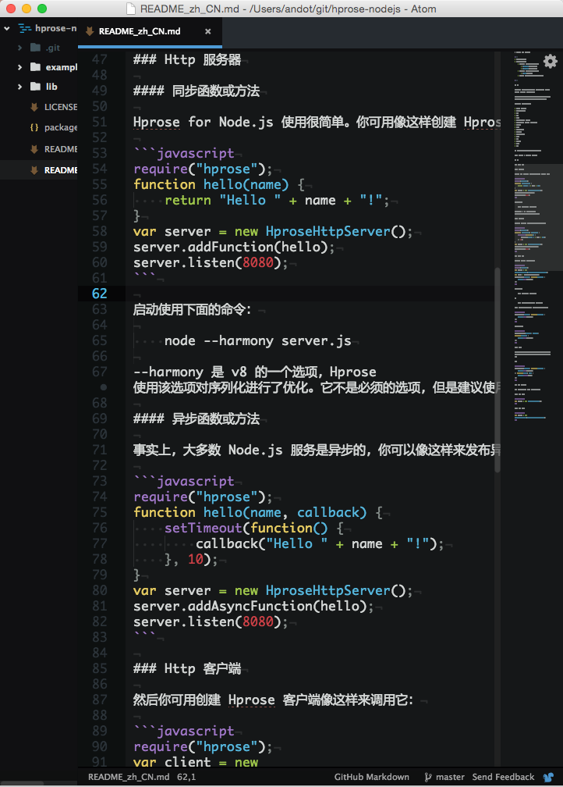

### 介绍

本项目是为方便用户将 Mac OS X Yosemite 的系统字体替换为 Zfull 字体而创建的。

Zfull 字体是一款包含有 8-24 号点阵的汉字字体，有简繁两个版本。
Zfull 字体不论在点阵还是矢量方式下显示都非常精美匀称，其内置的英文字体也是等宽的。
因此不论是作为系统字体，终端字体还是作为编程字体，都是非常合适的。

下面是一些实际使用效果的截图：

如果你觉得效果还不错，那就来看一下如何安装吧。

### 安装

最简单的方法是，先把本项目 git clone 到本地，然后执行 `install.sh` 脚本，然后重启电脑就可以了。

手动安装方法是：

1. 把 `fonts` 目录下的字体复制到 `/System/Library/Fonts/` 下，一定不要放错目录，否则再替换配置文件之后，某些系统界面的汉字会变成方块。

2. 把 `configs` 目录下的两个文件复制到 `/System/Library/Frameworks/CoreText.framework/Versions/A/Resources` 下，替换原来的两个文件。

3. 修复权限（可以使用磁盘工具，也可以参考 `install.sh` 中的修复权限的脚本代码），重启电脑就可以了。

### 卸载

简单的方法是，执行 `uninstall.sh` 脚本，然后重启电脑。

手动卸载方法是：

1. 把 `backup` 目录下的两个文件复制到 `/System/Library/Frameworks/CoreText.framework/Versions/A/Resources` 下，替换原来的两个文件。

2. 删除 `/System/Library/Fonts/` 下的 `Zfull-GB.ttf` 和 `Zfull-BIG5.ttf`。这一步是可选的，你也可以保留这两个文件。

3. 修复权限（可以使用磁盘工具，也可以参考 `uninstall.sh` 中的修复权限的脚本代码），重启电脑就可以了。
