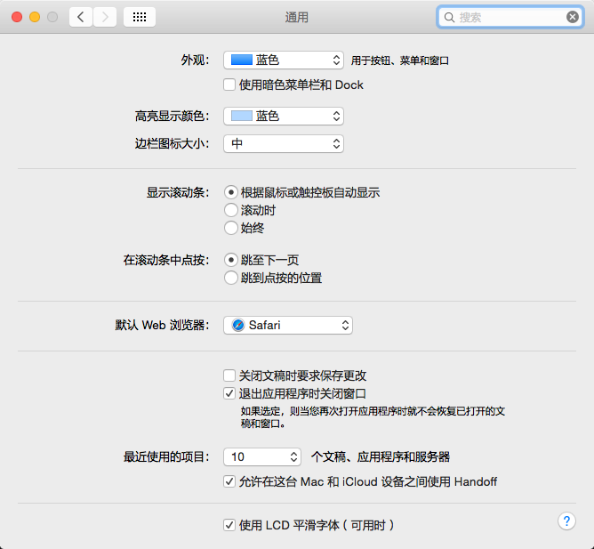
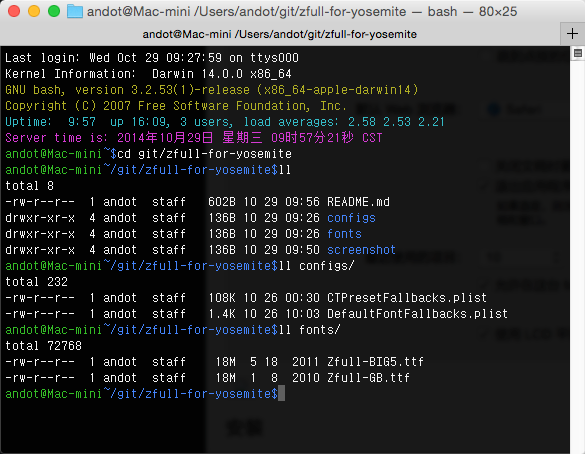
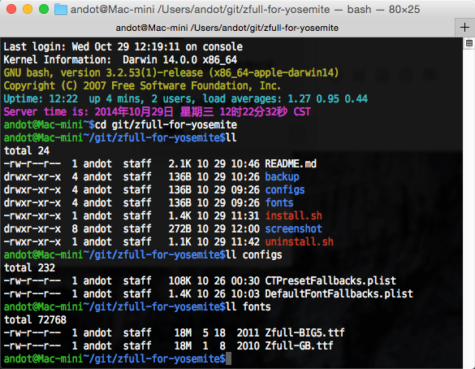
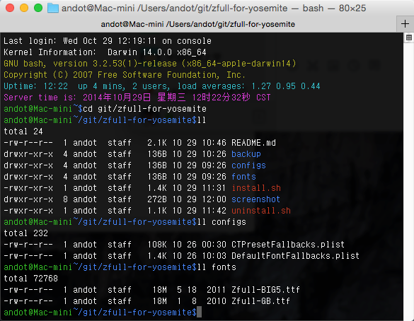
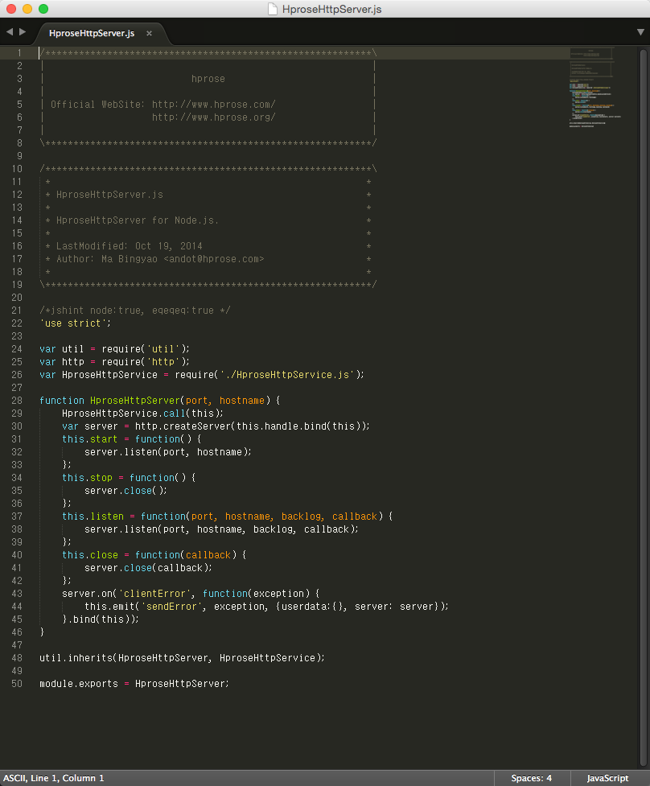
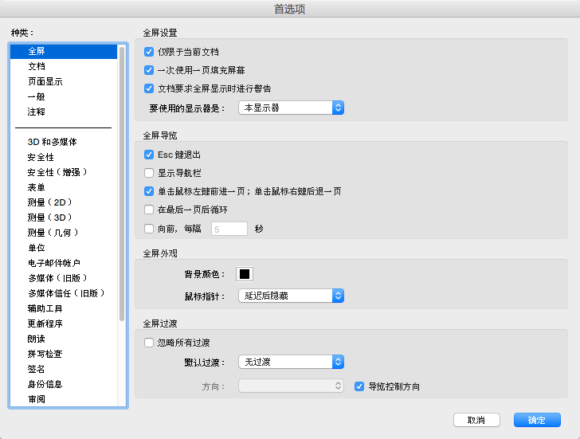
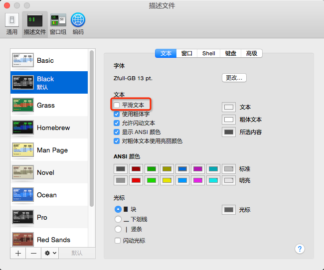

### 介绍

本项目是为方便用户将 Mac OS X Yosemite 的系统字体替换为 Zfull 字体而创建的。

Zfull 字体是一款包含有 8-24 号点阵的汉字字体，有简繁两个版本。
Zfull 字体不论在点阵还是矢量方式下显示都非常精美匀称，其内置的英文字体也是等宽的。
因此不论是作为系统字体，终端字体还是作为编程字体，都是非常合适的。

下面是一些实际使用效果的截图：













如果你觉得效果还不错，那就来看一下如何安装吧。

### 安装

最简单的方法是，先把本项目 git clone 到本地，然后执行 `install.sh` 脚本，然后重启电脑就可以了。

手动安装方法是：

1. 把 `fonts` 目录下的字体复制到 `/System/Library/Fonts/` 下，一定不要放错目录，否则再替换配置文件之后，某些系统界面的汉字会变成方块。

2. 把 `configs` 目录下的两个文件复制到 `/System/Library/Frameworks/CoreText.framework/Versions/A/Resources` 下，替换原来的两个文件。

3. 修复权限（可以使用磁盘工具，也可以参考 `install.sh` 中的修复权限的脚本代码），重启电脑就可以了。

### 卸载

简单的方法是，执行 `uninstall.sh` 脚本，然后重启电脑。

手动卸载方法是：

1. 把 `backup` 目录下的两个文件复制到 `/System/Library/Frameworks/CoreText.framework/Versions/A/Resources` 下，替换原来的两个文件。

2. 删除 `/System/Library/Fonts/` 下的 `Zfull-GB.ttf` 和 `Zfull-BIG5.ttf`。这一步是可选的，你也可以保留这两个文件。

3. 修复权限（可以使用磁盘工具，也可以参考 `uninstall.sh` 中的修复权限的脚本代码），重启电脑就可以了。

### 关于反锯齿

很多人喜欢 Mac OS X 的平滑字体，也有一些人喜欢点阵字体（比如我），尤其是在非 Retina 屏幕下小字显示时，平滑字体往往显示的是一团糊糊。

这里介绍几个关闭反锯齿效果的小技巧。

#### 关闭系统对于小字的反锯齿效果

    defaults write -g AppleAntiAliasingThreshold 11

在终端下执行上面这条语句就可以关闭小于 11pt 字体的反锯齿效果了。这个字号你也可以写其它的，比如 10，18，24 等等，反正 Zfull 字体 24pt 以下都是包含点阵的。

其实在 Mac OS X 10.8 及其之前版本的`系统偏好设置-通用`中就包含了这个设置，只不过通过选项来选择的字号最大只有 12。
在 Mac OS X 10.9 及其之后版本的系统中，这个选项被取消了，而且通过该命令行来设置对系统本身也不起作用了。
所以在 Yosemite 中使用该命令行只对一些比较老的软件起作用，对于系统包含的软件和大部分为 Mac OS X 10.9 以后的系统开发的软件已经不起作用了。

经过测试该方法有作用的软件：

* Microsoft Office 2011
* Adobe CS 6 (或更早的版本)
* Adobe Acrobat XI Pro (或更早版本)
* Adobe Reader
* 一些使用 Java 6 的软件，如 Eclipse 等。

如果要还原反锯齿效果，执行下面这行命令即可：

    defaults delete -g AppleAntiAliasingThreshold

#### 终端下关闭反锯齿效果

在终端偏好设置中，将字体设置为 Zfull-GB，然后去掉平滑字体前面的对钩即可，如图：



#### Sublime Text 下关闭反锯齿效果

在 Sublime Text 的用户设置中加入如下代码即可：

```json
	"font_face": "Zfull-GB",
	"font_options":
	[
		"no_antialias",
		"no_italic"
	],
	"font_size": 13,
```
